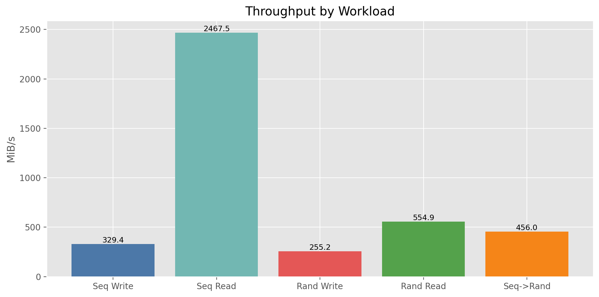
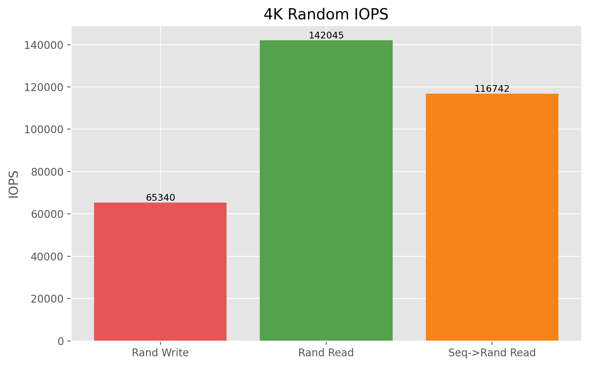
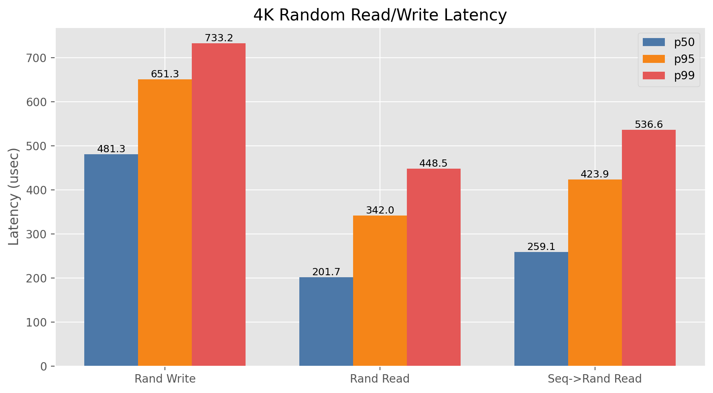
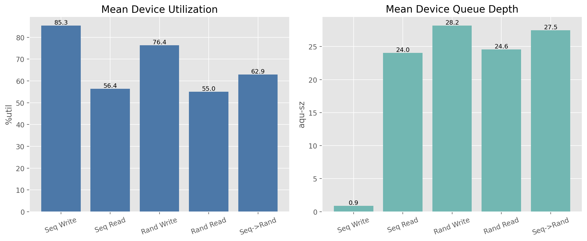
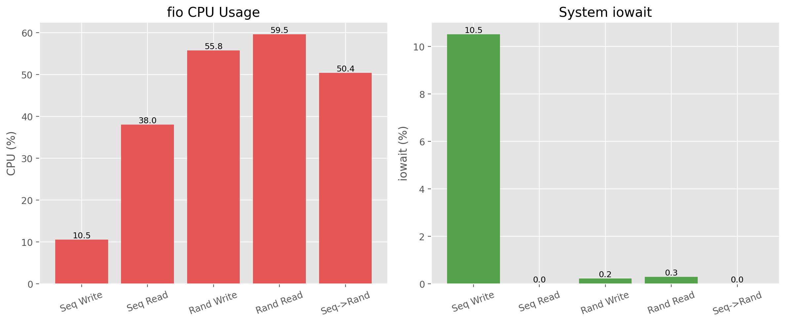
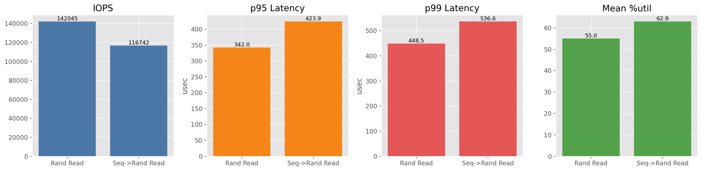

- note: for python package management, [uv](https://docs.astral.sh/uv/) is used
##  Kernel Basics
## 1: Install a Linux distro 

I already had a linux 'server' (old laptop running ubuntu), so I ssh'ed into it to access a x86 linux environment.

## 2: Building Linux From Source

Assuming all build tools are installed, first, from kernel.org, we install the latest release (7.0.9) and extract the tar file 

```bash
wget https://cdn.kernel.org/pub/linux/kernel/v7.x/linux-7.0.9.tar.xz
tar -xf linux-7.0.9.tar.xz
```

Then, copy the host device config and then build with -j for multicore builds. Given a lot of options for config, I chose the default options, trusting the Kernel devs. 

```bash
cp /boot/config-$(uname -r) .config
make menuconfig
make -j$(nproc) && sudo make modules_install -j$(nproc)
```

While building, this error popped up:

```
No rule to make target 'debian/canonical-certs.pem', needed by 'certs/x509_certificate_list'.  Stop.
```

An existing [stack overflow](https://askubuntu.com/questions/1329538/compiling-kernel-5-11-11-and-later) thread explained that I had to set the keys to null in config: 

```
CONFIG_SYSTEM_TRUSTED_KEYS=""
CONFIG_SYSTEM_REVOCATION_KEYS=""
```

Finally, to install the core kernel library and update the bootloader, I ran 

```bash
sudo make install
sudo reboot
```

Then, re-connected to my server through ssh and ran 

```
uname -r 
```

and verified the output to be the latest version of Linux that i installed (7.0.9).

One last note is that I had to disable secure boot on the host machine since I set the Ubuntu signatures to "".

Online Resources Used: 
- https://kernelnewbies.org/KernelBuild 
- https://www.youtube.com/watch?v=APQY0wUbBow (Linux Kernel Compilation Guide)
- https://docs.kernel.org/process/changes.html (required build tools / versions)

## 3: Modifying the Kernel (adding a syscall)

A new directory is created in this repo: `syscall_userspace/`

First, before continuing further, the compile commands were generated to get the LSP in my editor to function properly

```bash
python3 scripts/clang-tools/gen_compile_commands.py
```

Then, from the kernel docs, to implement a syscall, one must follow these steps: 

1. register the syscall number in `arch/x86/entry/syscalls/syscall_64.tbl`
```
491 common getmemutil       sys_getmemutil
```

2. add prototype matching the calling convention in `include/linux/syscalls.h`
```c
asmlinkage long sys_getmemutil(void);
```

3. implement in `kernel/sys.c` with `SYSCALL_DEFINEn` macro
 
From `include/uapi/linux/sysinfo.h` we see that the `sysinfo` struct holds information about memory usage

```C
struct sysinfo {
	// ...
	__kernel_ulong_t totalram;	/* Total usable main memory size */
	__kernel_ulong_t freeram;	/* Available memory size */
	// ...
};
```

and to get the values, `mm/show_mem.c` contains the function for populating the `sysinfo` struct

```C
void si_meminfo(struct sysinfo *val)
{
	// ...
	val->totalram = totalram_pages();
	val->freeram = global_zone_page_state(NR_FREE_PAGES);
	// ...
}
```

Thus, for the calculation of ram utilization, it is a simple function in sys.c utilizing the `sysinfo` struct and `si_meminfo()` function. We add the snippet to `sys.c` using the `SYSCALL_DEFINEn` macro:

```C
SYSCALL_DEFINE0(getmemutil)
{
	struct sysinfo si;
	si_meminfo(&si);
	if (si.totalram == 0) {
		return 0;
	}

	return 10000 * (si.totalram - si.freeram) / si.totalram;
}
```

Next, the kernel docs suggest doing the next two steps: 

4. add fall back stub in `sys_ni.c` with `COND_SYSCALL()`
5. add generic definition to `include/uapi/asm-generic/unistd.h`

However, because we are only working with x86 architectures, fall back stubs for unsupported architectures will not be implemented, and the generic definitions are also unnecessary as "Some architectures (e.g. x86) have their own architecture-specific syscall tables" (from kernel docs)

Thus, we will skip steps 4 and 5. 

The sys call is now implemented, and we can build/compile/install and reboot into our new kernel

```bash
make -j$(nproc) && sudo make modules_install && sudo make install && sudo reboot
```


Resources Used: 
- https://docs.kernel.org/process/adding-syscalls.html 

## 3.1: User Level Program Utilizing Syscall 491

First was creating the program in [syscall_userspace/main.c](./syscall_userspace/main.c) to call our created syscall and log it to a csv file. The program runs as follows:
1. open / create the file (csv)
2. loop forever, where in each loop:
	1. call `syscall(491)` to get the memory utilization
	2. get the current timestamp
	3. write to the csv with timestamp, utilization

Then, with `matplotlib` in [syscall_userspace/plot.py](./syscall_userspace/plot.py), the system utilization over time can be plotted with time on x and utilization on y axes. The plot is then saved as a jpg

To run, the C program was compiled and ran while on the host machine an app like firefox was opened / used. 

```bash
gcc main.c -o main
./main

#after running test, run plotter
uv run plot.py
```


Here, firefox was opened, then four tabs were opened and connected to different websites. Each spike in utilization corresponds to firefox process creation, tab 2, tab3, and tab4.

Because each browser tab is its own process with its own virtual memory space, each new tab requires a chunk of memory, and thus the memory usage increases. 

Resources:
-  https://docs.github.com/en/authentication/connecting-to-github-with-ssh
- https://man7.org/linux/man-pages/man2/syscall.2.html

---
## Benchmarking Basics

## 4: Building and Configuring fio

To install `fio` from source, we clone, build and then install it to path

```bash
git clone https://github.com/axboe/fio.git
cd fio
./configure # configure system
make -j$(nproc) # build
sudo make install # install system wide
```

Also, a new directory in the repo is created for this section of the assignment: `fio_benchmarks/`

## 5: Running The Experiment

Using `iostat` and `fio`, data will be collected from the followings tests for a total of 5 tests:
- sync/async sequential read / read with a 2G file
- sync/async random write / read with a 2G file
- sequential write, then random read with 2G file and 4K read 

Because the configuration for each test requires tedious setup, an automated bash script is created in [fio_benchmarks/benchmark.sh](./fio_benchmarks/benchmark.sh). 

In `benchmark.sh`, each step follows the general process 
1. echo (log) to the terminal which test will be run 
2. start `iostat` and take a measurement every second, and output to a log file in `raw/`
3. save the `pid` in a variable  so that we can kill the process when fio is done running
4. run `fio` with the corresponding flags according to the [docs](https://fio.readthedocs.io/en/latest/fio_doc.html#running-fio)
	- `--name=` for internal label
	- `--rw=` for write, read, etc
	- `--ioengine=` to choose sync/async
	- `--iodepth=` to set queue depth for async engine
	- `--direct=1` bypass the OS page cache (RAM)
	- `--bs=` block size, 128K for sequential, 4K for random (for efficiency)
	- `--size=2G` set size
	- `--filename=testfile.img` name of dummy file fio creates
	- `--output-format=json` make json 
	- `--output=` where to save file
5. kill `iostat`
6. sleep for 2 seconds before running the next test

We can then run the shell script to run the benchmarks 

```bash
chmod +x benchmark.sh # grant execute permissions to script
./benchmark.sh # run 
```

 On the first try, I ran into this error: 

```
fio: engine libaio not loadable
fio: failed to load engine
fio: file:ioengines.c:142, func=dlopen, error=libaio: cannot open shared object file: No such file or directory
```

To fix this, i ran `fio --enghelp` to see the list of available engines and configured the fio scripts in [benchmark.sh](./fio_benchmarks/benchmark.sh) to use an available async io engine (io_uring). 

Resources:
- https://man7.org/linux/man-pages/man1/iostat.1.html
- https://fio.readthedocs.io/en/latest/fio_doc.html#running-fio

## 6: Refining Results

To refine the dataset from the messy log and json, I considered the following questions for each workload:
1. How fast is it? 
2. What was the latency?
3. How hard did it push the CPU and SSD?
4. How can the differences be explained? 

**Thus, from `fio`, the following fields were extracted:**
- **throughput_mib_per_sec**: For sequential workloads, throughput is usually the key indicator for how much data was moved
- **iops**: For small random work loads, IO operations per second is one of the main metrics.
- **runtime_seconds**: Not as important, but a sanity check for whether we should trust `iostat`'s data.
- **bytes_transferred**: A field for validating that throughput matches how much data is actually transferred.
- **latency_usec.p50, p95, p99, p99_9**: This tells us 
	- p50: typical request
	- p95: 'bad but common' requests
	- p99: tail behavior
	- p99_9: rare latency spikes
- **cpu_percent.user, system, total**: This tells us how much CPU work the benchmark generated

**Then, from `iostat`, the following fields were extracted**
- **mean,max_iowait_percent**: this tell us how much time the CPU was waiting on IO, useful for checking blocking behavior
- **mean,max_util_percent**: this tells us how 'saturated' the device was 
- **mean,max_queue_depth**: this tell s how much work was queued, which will be useful for comparing async and sync behavior
- **mean_read/write_mib_per_sec**: validation for `fio` output, to check that read-heavy show read bandwidth and write-heavy shows write bandwidth
- **mean_read/write_await_ms**: device side waiting, it should move with `fio`'s latency data

Then, to extract this data and clean it up into a clean JSON file, [process_results.py](./fio_benchmarks/process_results.py) is created where
1.  `main()` hardcodes the five benchmark names and builds one result object per test.
2. `build_run()` reads one `fio` JSON and extracts config, throughput, IOPS, latency, and CPU.
3. `parse_iostat()` reads the matching iostat log, keeps only iowait and the nvme0n1 row, skips the first sample, and summarizes utilization, queue depth, bandwidth, and await.
	- note: we only use the nvme0n1 row because it is the only useful row in iostat
4. `summary()` flattens each full result into one compact row for plotting.
5. The final JSON writes both:
  - runs: detailed per-test data
  - summary: simple per-test comparison rows

The other functions are simple helpers for averages and unit conversions

This can be run with 
```bash
uv run process_results.py
```

and the final data exists in [fio_benchmarks/results/processed/consolidated.json](./fio_benchmarks/results/processed/consolidated.json)

## 7: Plotting

There are 6 total plots:
1. Throughput
2. Random IOPS (read/write)
3. Random latency (read/write)
4. Device pressure in the form of %util
5. CPU and iowait
6. Rand read vs Seq then rand read

To do this, [plot_results.py](./fio_benchmarks/plot_results.py) does the following:

  1. load processed benchmark data
  2. select the exact metrics needed for each predefined chart
  3. render and save the six figures 
  
  - `main()`, it pulls out the five fixed workloads by name
  - It creates the plots output directory and sets `Matplotlib` up for file-based rendering.
  - It then calls six fixed plotting functions, each responsible for one report figure.
  - `plot_throughput()` makes a bar chart of throughput for all five workloads.
  - `plot_random_iops()` makes a bar chart of IOPS for the random-style workloads only.
  - `plot_random_latency()` makes a grouped bar chart of p50, p95, and p99 latency for the random-style workloads.
  - `plot_device_pressure()` makes a two-panel figure for mean device utilization and mean queue depth.
  - `plot_cpu_and_iowait()` makes a two-panel figure for fio CPU usage and system iowait.
  - `plot_random_read_comparison()` makes a focused comparison between rand_read_async and seq_to_rand using IOPS, p95,
    p99, and %util.
  - `find_by_name()` is just a helper to fetch one workload from the loaded JSON.
  - `save_plot()` saves each figure as a PNG in fio_benchmarks/results/plots.
  - `add_value_labels()` writes the numeric value above each bar so the charts are easier to read.

  This can then be run with 
  ```bash
  uv run plot_results.py
  ```

### 7.1: Analysis of Results

1: Throughput

- **Sequential reads have the highest throughput** because modern NVMe SSDs are optimized for large, contiguous blocks of data. 
	- Sequential reads use a large block size (bs=128k) with an async engine, allowing the SSD controller to pre-fetch data into internal cache
- Because NAND flash cannot overwrite data in place and must erase blocks before writing, **write throughput is significantly lower** 
- **random read/writes have lower throughput** because random tests use bs=4k, and thus due to the overhead of small blocks, the controller must constantly hammer the FTL for lookups, which throttles raw bandwidth

2: Random IOPS 

- **reads have higher IOPS** because they use io_uring with a deep queue (32) which allows the OS to flood the SSD with 32 parallel IO requests at a time, saturating the drive channels
- **writes have lower IOPS** because random 4k writes force the SSD to constantly perform read-modify-write cycles across large NAND blocks

3: Random Latency

- **random read has the lowest latency** at all latencies because a 4k read is a voltage check on a NAND cell
- **random write has the highest latency** because a 4k write requires finding free pages, updating the FTL lookup, and occasional garbage collection

4: Device Pressure

- **Async workloads have highest average queue depths** because the async tests push 32 requests out simultaneously, which iostat records as a deep queue
	- because of the io depth being 32, the pipeline was always saturated, leading to a high utilization
- **Sequential write's queue depth stays near 1** because of io_engine=sync, meaning the CPU sends one block at a time, blocking until it's finished writing
- **Sequential write shows high disk utilization** despite its shallow queue depth as it's constantly writing
- **Sequential read** is deceptive because iostat sampled at 1-second intervals, and the sequential read finished in less than second; the idle time was not fully captured. Thus its utilization is modest, only at 56%
	- to fix this, next time it would be better to increase sampling rate of iostat and use a larger file size 

5: CPU and iowait

- **Async random workloads consume a large amount of host CPU** because driving 100k IOPS requires the CPU to process thousands of I/O submissions/completions every second
	- context switching and processing drains CPU cycles
	- also, because direct=1, we bypass the kernel cache and force the hardware subsystem and io_uring to process it directly, leading to higher CPU usage
- **Sequential write shows low CPU usage but large iowait** because with a synchronous engine, the thread must wait for the write task to finish

6: Random Read vs Seq->Rand Read

The SSD's internal block mapping should benefit from sequential write then random read because of the data being laid down in sequential blocks from the read. However, this did not happen. 

It may have been because writing the file sequentially left the SSD controller managing dirty blocks or updating/organizing FTL pages. Because the random read was initiated immediately after the write with no sleep period, the controller may have been busy.  In a future test, it would be better to sleep before initiating the read to get expected behavior. 
