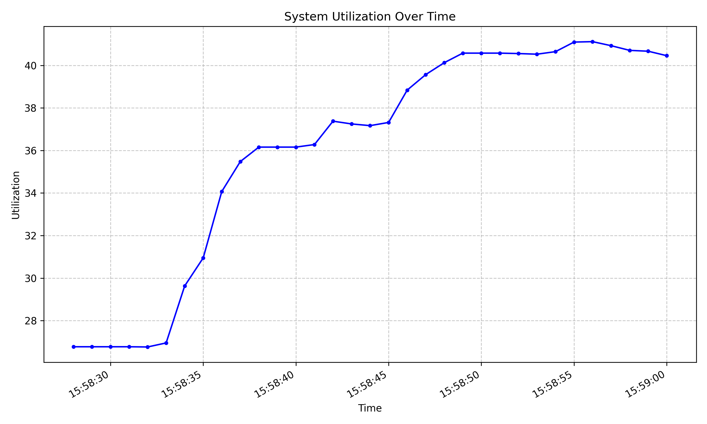
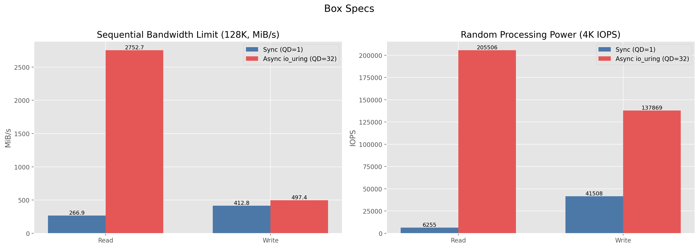
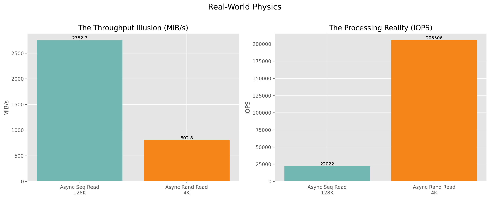
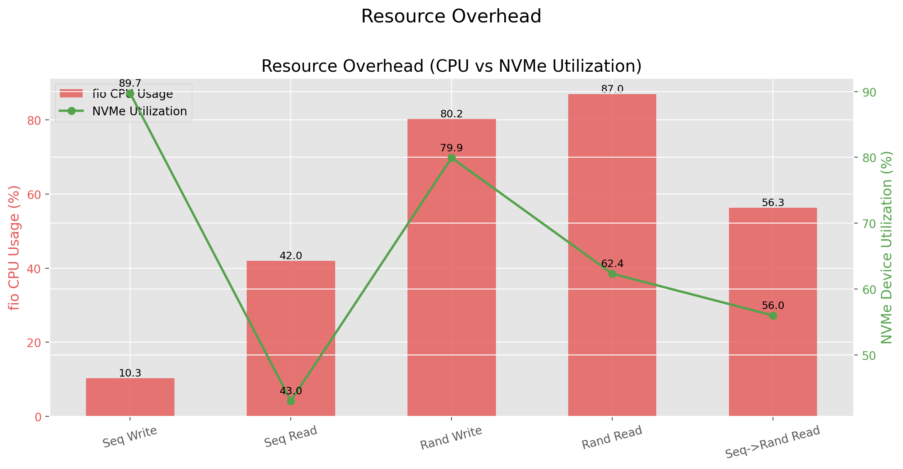
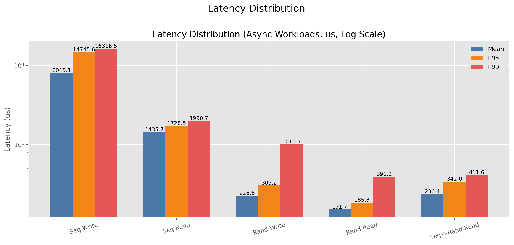
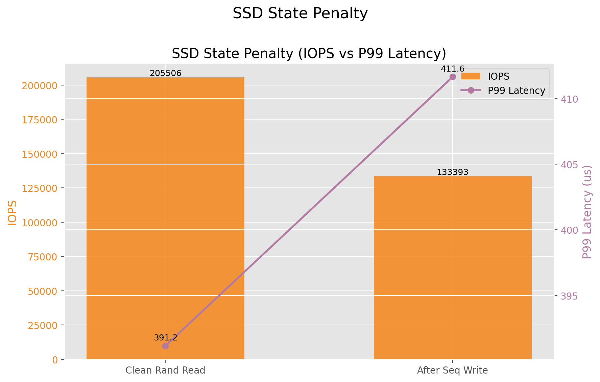

- note: for python package management, [uv](https://docs.astral.sh/uv/) is used
##  Kernel Basics
## 1: Install a Linux distro 

I already had a linux 'server' (old laptop running ubuntu), so I ssh'ed into it to access a x86 linux environment.

## 2: Building Linux From Source

Assuming all build tools are installed, first, from kernel.org, we install the latest release (7.0.9) and extract the tar file 

```bash
wget https://cdn.kernel.org/pub/linux/kernel/v7.x/linux-7.0.9.tar.xz
tar -xf linux-7.0.9.tar.xz
```

Then, copy the host device config and then build with -j for multicore builds. Given a lot of options for config, I chose the default options, trusting the Kernel devs. 

```bash
cp /boot/config-$(uname -r) .config
make menuconfig
make -j$(nproc) && sudo make modules_install -j$(nproc)
```

While building, this error popped up:

```
No rule to make target 'debian/canonical-certs.pem', needed by 'certs/x509_certificate_list'.  Stop.
```

An existing [stack overflow](https://askubuntu.com/questions/1329538/compiling-kernel-5-11-11-and-later) thread explained that I had to set the keys to null in config: 

```
CONFIG_SYSTEM_TRUSTED_KEYS=""
CONFIG_SYSTEM_REVOCATION_KEYS=""
```

Finally, to install the core kernel library and update the bootloader, I ran 

```bash
sudo make install
sudo reboot
```

Then, re-connected to my server through ssh and ran 

```
uname -r 
```

and verified the output to be the latest version of Linux that i installed (7.0.9).

One last note is that I had to disable secure boot on the host machine since I set the Ubuntu signatures to "".

Online Resources Used: 
- https://kernelnewbies.org/KernelBuild 
- https://www.youtube.com/watch?v=APQY0wUbBow (Linux Kernel Compilation Guide)
- https://docs.kernel.org/process/changes.html (required build tools / versions)

## 3: Modifying the Kernel (adding a syscall)

A new directory is created in this repo: `syscall_userspace/`

First, before continuing further, the compile commands were generated to get the LSP in my editor to function properly

```bash
python3 scripts/clang-tools/gen_compile_commands.py
```

Then, from the kernel docs, to implement a syscall, one must follow these steps: 

1. register the syscall number in `arch/x86/entry/syscalls/syscall_64.tbl`
```
491 common getmemutil       sys_getmemutil
```

2. add prototype matching the calling convention in `include/linux/syscalls.h`
```c
asmlinkage long sys_getmemutil(void);
```

3. implement in `kernel/sys.c` with `SYSCALL_DEFINEn` macro
 
From `include/uapi/linux/sysinfo.h` we see that the `sysinfo` struct holds information about memory usage

```C
struct sysinfo {
	// ...
	__kernel_ulong_t totalram;	/* Total usable main memory size */
	__kernel_ulong_t freeram;	/* Available memory size */
	// ...
};
```

and to get the values, `mm/show_mem.c` contains the function for populating the `sysinfo` struct

```C
void si_meminfo(struct sysinfo *val)
{
	// ...
	val->totalram = totalram_pages();
	val->freeram = global_zone_page_state(NR_FREE_PAGES);
	// ...
}
```

Thus, for the calculation of ram utilization, it is a simple function in sys.c utilizing the `sysinfo` struct and `si_meminfo()` function. We add the snippet to `sys.c` using the `SYSCALL_DEFINEn` macro:

```C
SYSCALL_DEFINE0(getmemutil)
{
	struct sysinfo si;
	si_meminfo(&si);
	if (si.totalram == 0) {
		return 0;
	}

	return 10000 * (si.totalram - si.freeram) / si.totalram;
}
```

Next, the kernel docs suggest doing the next two steps: 

4. add fall back stub in `sys_ni.c` with `COND_SYSCALL()`
5. add generic definition to `include/uapi/asm-generic/unistd.h`

However, because we are only working with x86 architectures, fall back stubs for unsupported architectures will not be implemented, and the generic definitions are also unnecessary as "Some architectures (e.g. x86) have their own architecture-specific syscall tables" (from kernel docs)

Thus, we will skip steps 4 and 5. 

The sys call is now implemented, and we can build/compile/install and reboot into our new kernel

```bash
make -j$(nproc) && sudo make modules_install && sudo make install && sudo reboot
```


Resources Used: 
- https://docs.kernel.org/process/adding-syscalls.html 

## 3.1: User Level Program Utilizing Syscall 491

First was creating the program in [syscall_userspace/main.c](./syscall_userspace/main.c) to call our created syscall and log it to a csv file. The program runs as follows:
1. open / create the file (csv)
2. loop forever, where in each loop:
	1. call `syscall(491)` to get the memory utilization
	2. get the current timestamp
	3. write to the csv with timestamp, utilization

Then, with `matplotlib` in [syscall_userspace/plot.py](./syscall_userspace/plot.py), the system utilization over time can be plotted with time on x and utilization on y axes. The plot is then saved as a jpg

To run, the C program was compiled and ran while on the host machine an app like firefox was opened / used. 

```bash
gcc main.c -o main
./main

#after running test, run plotter
uv run plot.py
```



Here, firefox was opened, then four tabs were opened and connected to different websites. Each spike in utilization corresponds to firefox process creation, tab 2, tab3, and tab4.

Because each browser tab is its own process with its own virtual memory space, each new tab requires a chunk of memory, and thus the memory usage increases. 

Resources:
-  https://docs.github.com/en/authentication/connecting-to-github-with-ssh
- https://man7.org/linux/man-pages/man2/syscall.2.html

---
## Benchmarking Basics

## 4: Building and Configuring fio

To install `fio` from source, we clone, build and then install it to path

```bash
git clone https://github.com/axboe/fio.git
cd fio
./configure # configure system
make -j$(nproc) # build
sudo make install # install system wide
```

Also, a new directory in the repo is created for this section of the assignment: `fio_benchmarks/`

## 5: Running The Experiment

Using `iostat` and `fio`, data is collected for 9 measured workloads:
- sequential write: sync and async
- sequential read: sync and async
- random write: sync and async
- random read: sync and async
- random read immediately after a heavy sequential write (`seq_to_rand`)

There is also one extra unrecorded prep step, `seq_prep`, which sequentially writes the test file immediately before the final `seq_to_rand` benchmark so the SSD is measured in a "recently written" state.

Because the configuration for each test requires tedious setup, an automated bash script is created in [fio_benchmarks/benchmark.sh](./fio_benchmarks/benchmark.sh). 

In `benchmark.sh`, each step follows the general process 
1. echo (log) to the terminal which test will be run 
2. start `iostat` and take a measurement every second, and output to a log file in `raw/`
3. save the `pid` in a variable  so that we can kill the process when fio is done running
4. run `fio` with the corresponding flags according to the [docs](https://fio.readthedocs.io/en/latest/fio_doc.html#running-fio)
	- `--name=` for internal label
	- `--rw=` for write, read, etc
	- `--ioengine=` to choose sync/async
	- `--iodepth=` to set queue depth for async engine
	- `--direct=1` bypass the OS page cache (RAM)
	- `--bs=` block size, 128K for sequential, 4K for random (for efficiency)
	- `--size=2G` set size
	- `--filename=testfile.img` name of dummy file fio creates
	- `--output-format=json` make json 
	- `--output=` where to save file
5. kill `iostat`
6. sleep for 2 seconds before running the next test

We can then run the shell script to run the benchmarks 

```bash
chmod +x benchmark.sh # grant execute permissions to script
./benchmark.sh # run 
```

 On the first try, I ran into this error: 

```
fio: engine libaio not loadable
fio: failed to load engine
fio: file:ioengines.c:142, func=dlopen, error=libaio: cannot open shared object file: No such file or directory
```

To fix this, i ran `fio --enghelp` to see the list of available engines and configured the fio scripts in [benchmark.sh](./fio_benchmarks/benchmark.sh) to use an available async io engine (io_uring). 

Resources:
- https://man7.org/linux/man-pages/man1/iostat.1.html
- https://fio.readthedocs.io/en/latest/fio_doc.html#running-fio

## 6: Refining Results

To refine the dataset from the messy log and json, I considered the following questions for each workload:
1. How fast is it? 
2. What was the latency?
3. How hard did it push the CPU and SSD?
4. How can the differences be explained? 

**Thus, from `fio`, the following fields were extracted:**
- **throughput_mib_per_sec**: For sequential workloads, throughput is usually the key indicator for how much data was moved
- **iops**: For small random work loads, IO operations per second is one of the main metrics.
- **runtime_seconds**: Not as important, but a sanity check for whether we should trust `iostat`'s data.
- **bytes_transferred**: A field for validating that throughput matches how much data is actually transferred.
- **latency_usec.p50, p95, p99, p99_9**: This tells us 
	- p50: typical request
	- p95: 'bad but common' requests
	- p99: tail behavior
	- p99_9: rare latency spikes
- **cpu_percent.user, system, total**: This tells us how much CPU work the benchmark generated

**Then, from `iostat`, the following fields were extracted**
- **mean,max_iowait_percent**: this tell us how much time the CPU was waiting on IO, useful for checking blocking behavior
- **mean,max_util_percent**: this tells us how 'saturated' the device was 
- **mean,max_queue_depth**: this tell s how much work was queued, which will be useful for comparing async and sync behavior
- **mean_read/write_mib_per_sec**: validation for `fio` output, to check that read-heavy show read bandwidth and write-heavy shows write bandwidth
- **mean_read/write_await_ms**: device side waiting, it should move with `fio`'s latency data

Then, to extract this data and clean it up into a clean JSON file, [process_results.py](./fio_benchmarks/process_results.py) is created where
1.  `main()` hardcodes the 9 measured benchmark names and builds one result object per workload.
2. `build_run()` reads one `fio` JSON and extracts config, throughput, IOPS, latency, and CPU.
3. `parse_iostat()` reads the matching iostat log, keeps only iowait and the nvme0n1 row, skips the first sample, and summarizes utilization, queue depth, bandwidth, and await.
	- note: we only use the nvme0n1 row because it is the only useful row in iostat
4. `summary()` flattens each full result into one compact row for plotting.
5. The final JSON writes both:
  - runs: detailed per-test data
  - summary: simple per-test comparison rows

The other functions are simple helpers for averages and unit conversions

This can be run with 
```bash
uv run process_results.py
```

and the final data exists in [fio_benchmarks/results/processed/consolidated.json](./fio_benchmarks/results/processed/consolidated.json)

## 7: Plotting

The plotting code now produces 5 output figures, but they contain 7 distinct comparisons:
1. `01_box_specs.png`
2. `02_real_world_physics.png`
3. `03_resource_overhead.png`
4. `04_latency_distribution.png`
5. `05_state_penalty.png`

To do this, [plot_results.py](./fio_benchmarks/plot_results.py) does the following:

1. load processed benchmark data from `consolidated.json`
2. build `summary` and `runs` lookup maps by workload name
3. render the fixed report figures from those lookup maps

- `main()` sets up the output directory, configures Matplotlib for file-based rendering, and calls the five top-level plotting functions.
- `plot_box_specs()` generates a two-panel figure:
  - sequential bandwidth limit: sync vs async for 128K reads and writes
  - random processing power: sync vs async for 4K random reads and writes
- `plot_real_world_physics()` generates a two-panel figure:
  - throughput illusion: async sequential read vs async random read in MiB/s
  - processing reality: async sequential read vs async random read in IOPS
- `plot_resource_overhead()` generates a standalone dual-axis chart comparing fio CPU usage against NVMe device utilization across all async workloads.
- `plot_latency_distribution_standalone()` generates a standalone log-scale latency chart showing mean, p95, and p99 latency for all async workloads.
- `plot_state_penalty()` generates a standalone dual-axis chart comparing clean random reads against random reads immediately after a heavy sequential write.
- `draw_*()` helpers render each subplot into an existing axis so related charts can be grouped side by side without duplicating data-selection logic.
- `effective_device_util()` falls back to fio's `disk_util` section when a short run does not capture enough `iostat` interval samples.
- `save_plot()` writes each figure into `fio_benchmarks/results/plots`.
- `add_value_labels()` and `add_point_labels()` annotate bars and line points so the numeric values are visible in the exported report.

  This can then be run with 
  ```bash
  uv run plot_results.py
  ```

### 7.1: Analysis of Results

1: Box Specs

- The left panel shows the PCIe bandwidth story. Async sequential read reaches about `2752.7 MiB/s`, while sync sequential read only reaches about `266.9 MiB/s`, so a single blocking thread cannot feed the drive fast enough to hit its read bandwidth ceiling.
- The right panel shows the controller parallelism story. Async random read reaches about `205,506 IOPS`, while sync random read only reaches about `6,255 IOPS`, which shows that queueing many independent requests is what unlocks NVMe random-read performance.
- The sequential write side is much flatter than the sequential read side, which is a reminder that flash write behavior is constrained by erase/program work inside the SSD, not just host-side submission rate.

2: Real-World Physics

- The left panel shows the throughput illusion clearly: async sequential read delivers about `2752.7 MiB/s`, but async random read drops to about `802.8 MiB/s`. The access pattern changed, so the drive stopped streaming and started servicing scattered 4K requests.
- The right panel shows the inverse perspective. Even though random read moves much less total data per second, it does far more work in operation count: about `205k IOPS` for random read versus about `22k IOPS` for sequential read.
- Together, these two panels show the bottleneck shift: sequential read is mostly limited by transport bandwidth, while random read is mostly limited by the SSD controller's request processing capacity.

3: Resource Overhead

- High-IOPS async workloads are not free on the host. `rand_read_async` drives the device to roughly `62%` utilization while consuming about `87%` total fio CPU, and `rand_write_async` is similarly expensive.
- `seq_read_async` reaches the highest bandwidth but with lower reported device utilization than the random tests, reinforcing that bandwidth saturation and controller saturation are different things.
- For short runs such as `seq_write_async`, the plotting code falls back to fio's `disk_util` data because `iostat` did not capture enough interval samples.

4: Latency Distribution

- The log-scale view is important because averages alone hide tail behavior. `rand_read_async` has a mean latency of about `151.7 us`, but its p99 is still about `391.2 us`.
- `seq_write_async` is the clearest tail-latency warning in this dataset: it has an average latency of about `8015 us`, with p95 and p99 even higher, showing that deeper queues can create substantial internal waiting even when throughput is acceptable.
- This plot makes the main systems point: pushing queue depth to maximize throughput or IOPS usually worsens worst-case completion times.

5: SSD State Penalty

- Clean async random read reaches about `205,506 IOPS`, but random read immediately after a heavy sequential write drops to about `133,393 IOPS`.
- At the same time, p99 latency rises from about `391 us` to about `412 us`, which suggests the SSD is still doing background work after the write-heavy phase.
- This is the "drives have state" lesson: benchmark results are not only determined by the current request pattern, but also by what the device was doing immediately beforehand.
